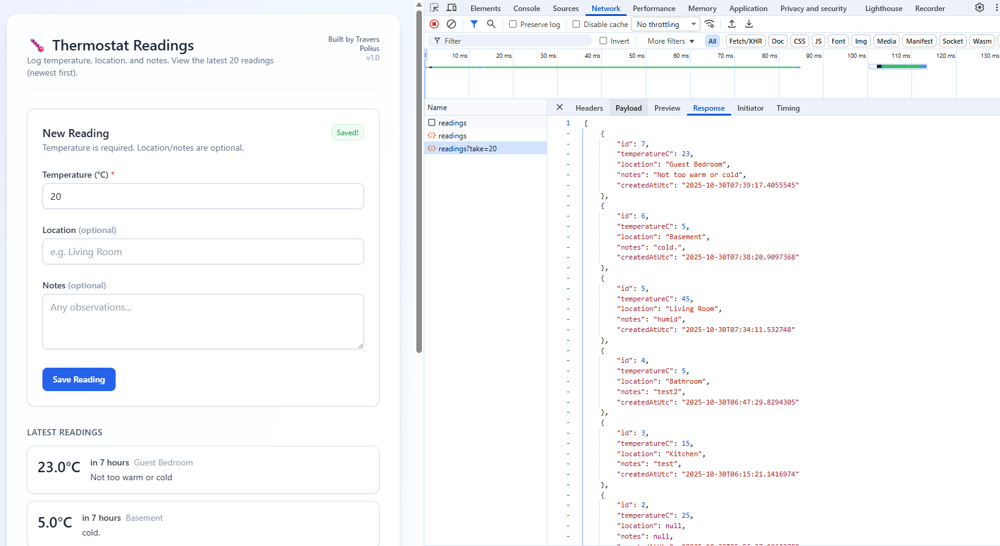

# 🌡️ Thermostat Readings App
**By Travers Polius | Built with Visual Studio 2022**

A full-stack web app that tracks and displays temperature readings, built entirely from scratch using **ASP.NET Core 8, Entity Framework Core (SQLite), React, TypeScript, and Tailwind CSS**.

This project demonstrates full CRUD integration between a .NET API backend and a modern React frontend — including model validation, DTO mapping, CORS configuration, and live data updates.

---

## 🚀 Tech Stack
| Layer | Technology |
|-------|-------------|
| **Frontend** | React + TypeScript + Vite + Tailwind CSS |
| **Backend** | ASP.NET Core 8 Web API |
| **Database** | SQLite + Entity Framework Core |
| **IDE** | Visual Studio 2022 |
| **Language** | C# / TypeScript |

---

## ⚙️ Features
✅ Create and save new temperature readings  
✅ Optional fields for *location* and *notes*  
✅ View the latest 20 readings, ordered by date  
✅ Input validation using C# data annotations  
✅ Clean, responsive Tailwind UI  
✅ Local SQLite persistence with EF Core  
✅ Seamless CORS communication between .NET backend and React frontend  

---

## 🧩 Architecture Overview
```
Frontend (React + Tailwind)
        │
        ▼
Backend API (ASP.NET Core)
        │
        ▼
Database (SQLite via EF Core)
```

- **DTOs** separate request (`CreateReadingDto`) and response (`ReadingDto`) data.
- **ReadingsController** handles `GET` and `POST` API endpoints.
- **EF Core** maps database entities with schema created by `Add-Migration InitialCreate`.

---

## 🧠 Learning Outcomes
Through this project, I reinforced my understanding of:
- Building **REST APIs** with ASP.NET Core
- Handling **JSON serialization** between C# and TypeScript
- Using **EF Core migrations** to create and update database schema
- Implementing **data validation** and error handling
- Integrating a **React TypeScript client** with a .NET backend
- Styling modern UI using **Tailwind CSS**

---

## 💻 Local Setup
**Requirements:**  
- Visual Studio 2022 (latest)  
- Node.js LTS  

**Steps:**
1. Clone or open the solution in VS 2022  
2. Run the following in Package Manager Console:
   ```powershell
   Add-Migration InitialCreate
   Update-Database
   ```
3. Start both the client and server (`Ctrl+F5`)

**Default URLs**
- API: https://localhost:7182  
- Client: https://localhost:51281  

---

## 📸 Demo Preview
| Screenshot | Description |
|-------------|--------------|
|  | Form to add new readings and live list of latest entries |

---

## 🧭 Future Enhancements
- Add **DELETE /api/readings** endpoint  
- Add **Edit** feature with `PUT /api/readings/{id}`  
- Deploy to **Azure App Service (API)** + **Vercel (Frontend)**  
- Add authentication and user accounts  

---

## 🧾 Summary
This project demonstrates a complete **end-to-end development workflow** — from designing a database schema to consuming APIs in a modern frontend — using today’s most in-demand Microsoft and web technologies.

**🧠 Core Skills Highlighted**
- ASP.NET Core 8 Web API  
- EF Core (SQLite)  
- React + TypeScript integration  
- Tailwind CSS + Vite  
- API design and validation  
- Visual Studio full-stack debugging  

---

**© 2025 Travers Polius**  
*Full-Stack Developer | ASP.NET | WordPress | React | SaaS | Game Dev Enthusiast*
